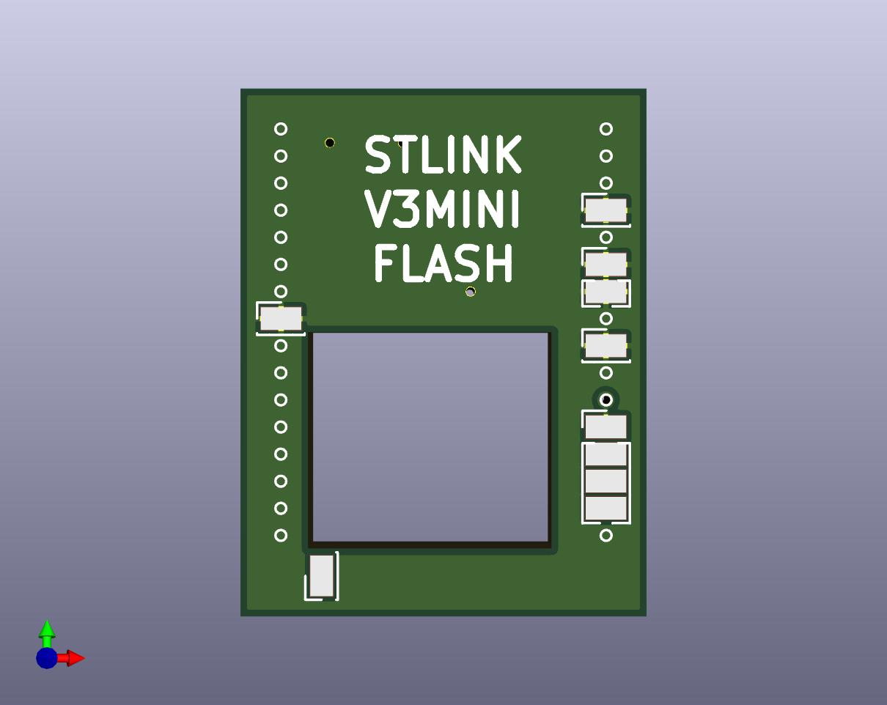
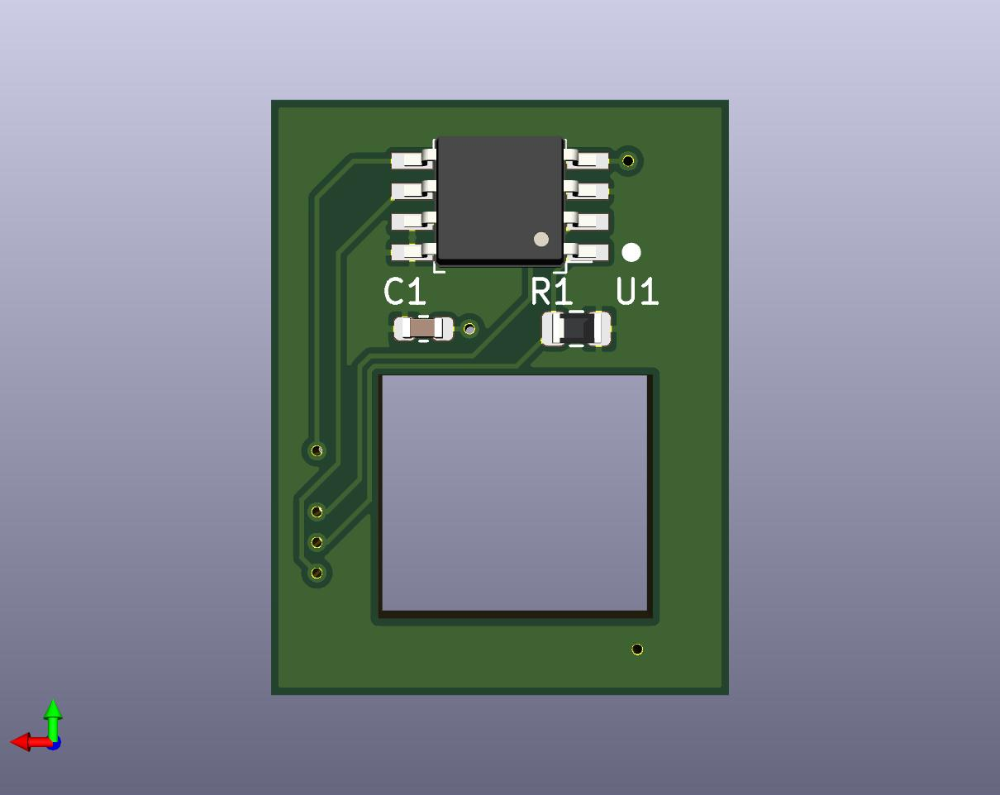

# stlink3-flash

 
 

This board adds 16 mbyte flash memory to [STLINK V3 MINI](https://www.st.com/zh/development-tools/stlink-v3mini.html), for storing micropython scripts.

[Schematic](docs/stlink3-flash-schematic.svg) 

BOM:

| Comp. | Desc          |
| ----- | ------------- |
| U1    | W25Q128JVSSIQ |
| C1    | 100n 0603     |
| R1    | 4k7 0603      |

Connections:

| Pin | Desc.     |
| --- | --------- |
| PE6 | SPI4_MOSI |
| PE5 | SPI4_MISO |
| PE4 | !FLASH_CS |
| PE2 | SPI4_SCK  |

Also solder ground and 3.3V.

[Gerber files](gerber.zip) 
